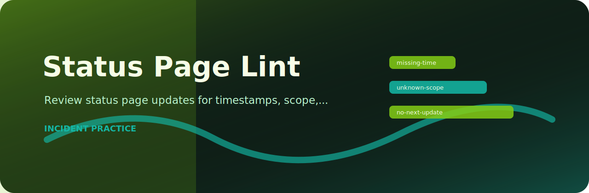

# Status Page Lint



> Review status page updates for timestamps, scope, and next-update promises

   

## At a glance

| Area | Detail |
| --- | --- |
| Focus | incident communications |
| Command | `status-page-lint` |
| Formats | text, JSON, JSONL, CSV |
| Output | Markdown table or JSON |

## What it checks

| Rule | Severity | What it catches |
| --- | --- | --- |
| `missing-time` | high | timestamp is missing |
| `unknown-scope` | medium | scope is unclear |
| `no-next-update` | low | next update time missing |

## Try it locally

```bash
python -m pip install -e ".[dev]"
status-page-lint examples/sample.txt
status-page-lint examples/sample.txt --json --fail-on medium
```

## Notes from the code

`rules.py` keeps the project policy explicit, while `core.py` handles parsing and report rendering. The CLI stays thin on purpose so the checks are easy to test.

## Verify

```bash
python -m pip install -e ".[dev]"
ruff check .
pytest
python -m status_page_lint --help
```
