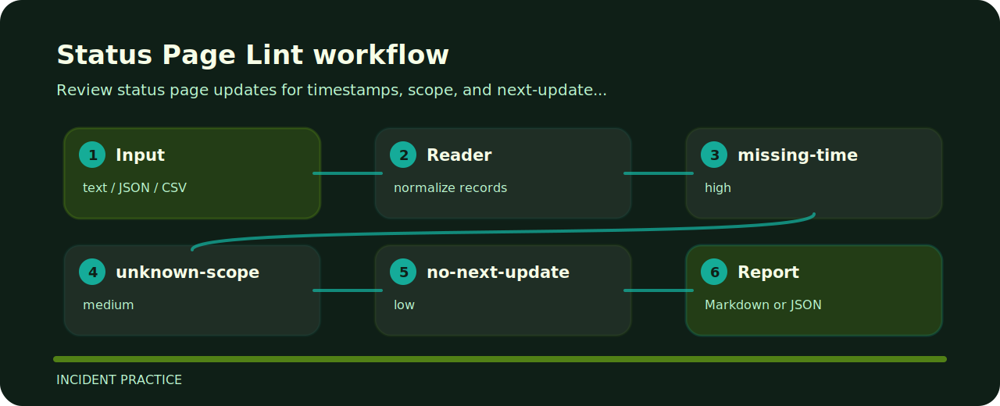

# Status Page Lint


This repository turns a tiny plain text into reviewable signals for incident communications.

## Decision points

| Signal | Level | What it flags | Fix direction |
| --- | --- | --- | --- |
| `missing-time` | high | timestamp is missing | include event timestamp |
| `unknown-scope` | medium | scope is unclear | state affected region or product |
| `no-next-update` | low | next update time missing | promise next communication time |

## Before the fix

```text
risky: degraded service time missing scope unknown next_update none
clean: degraded checkout time 10:30Z scope EU next_update 11:00Z
```

## Fresh clone path

```bash
git clone https://github.com/mertefekurt/status-page-lint.git
cd status-page-lint
python -m pip install -e ".[dev]"
status-page-lint examples/sample.txt
```

## Review path


